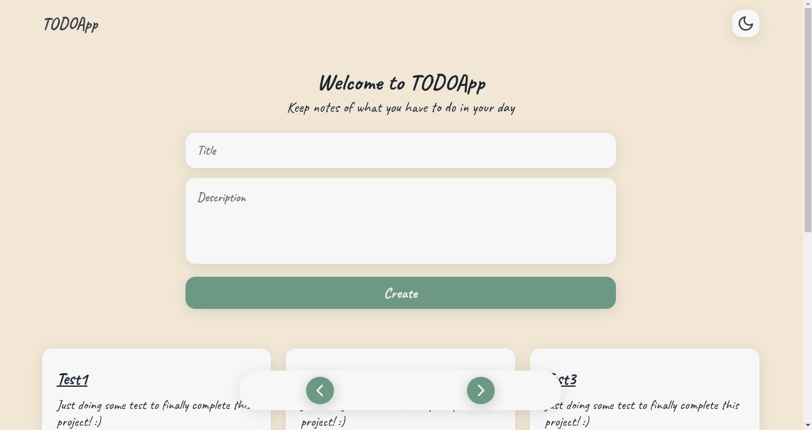
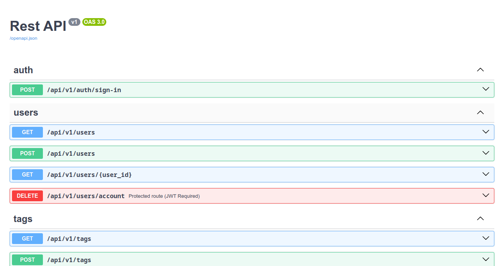
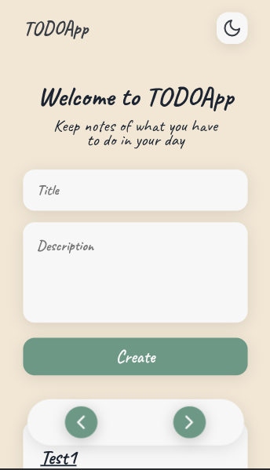
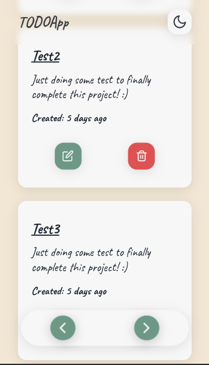
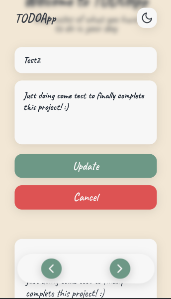

# todo-app-flask-reactjs

## Updating the repository...

This is a basic application with the objective of being able to save your notes and have them stored in a database. The user is able to perform basic actions such as create, read, update and delete this data, a basic CRUD.

## Table of contents

- [Built with](#built-with)
- [Project requirements and how to use it](#project-requirements-and-how-to-use-it)
  - [Frontend](#frontend)
  - [Backend](#backend)
  - [REST API](#rest-api)
- [Image gallery](#image-gallery)
  - [Desktop](#desktop)
  - [Mobile](#mobile)

## Built with

The project was developed from scratch with Frontend and Backend technologies, for the communication between the client and the server I implemented a REST API, which is responsible for returning the necessary data in JSON format to the client:

- Frontend:
  - ReactJS
  - SCSS
  - Styled Components

- Backend:
  - Python (Flask)
  - SQLite (As database manager)
  - Flask Migrate (To perform migrations)
  - SQLAlchemy and Flask SQLAlchemy (Python SQL toolkit and ORM that gives application developers the full power and flexibility of SQL)
  - REST API (For communication between client and server)

## Project requirements and how to use it

For the project you must run both development environments at the same time, both the Frontend and the Backend. In the Frontend you will find JavaScript technologies (ReactJS) and in the Backend you will find Python technologies and tools (Flask), so you must have NodeJS and Python installed on your computer (As a reference this project was developed with version 3.9.6 of Python and 18.12.1 of NodeJS).

I leave you links to NodeJS and Python for installation:
  - [NodeJS website](https://nodejs.org/en/)
  - [Python website](https://www.python.org/)

First of all download the project to start using it, do it from the terminal:

```shell
$ git clone https://github.com/Remy349/todo-app-flask-reactjs.git

$ cd todo-app-flask-reactjs
```

If you did it correctly and there were no problems, you should see these folders in your terminal:

```shell
/backend
/frontend
/preview
README.md
```

### Frontend

If you already have NodeJS installed on your computer perform the following steps to run the Frontend (Remember that the Backend must be running):

1. Move to the `/frontend` folder and run the following command to install the necessary:

```shell
# This will install what you need for the Frontend (npm comes with NodeJS after installation)
$ npm install
```

2. Then you will need to run the following command to start running the Frontend:

```shell
$ npm run dev

# You will see something like this:
> frontend@0.0.0 dev
> vite

  VITE v3.2.4  ready in 2079 ms

  ➜  Local:   http://localhost:5173/
  ➜  Network: use --host to expose
```

3. That's all for the Frontend, if you haven't run the Backend yet, continue with the next section (Backend)

### Backend

If you already have Python installed on your computer perform the following steps to run the Backend

1. Move to the `/backend` folder and run the following command to create a virtual development environment with Python:

```shell
# If it doesn't work this way try "python3", this will depend on how you installed Python on your computer
$ python -m venv venv
```

2. Now activate the development environment and install the necessary requirements found in the `requirements.txt` file:

```shell
# This is how it is done in Linux, in Windows it is as follows "venv\Scripts\activate"
$ . venv/bin/activate
# Now install the necessary requirements using "pip" or "pip3",
# this will depend on how you installed Python on your computer
(venv) $ pip install -r requirements.txt
```

3. Now you can start running the server:

```shell
(venv) $ flask run

# You will see something like this:
DATABASE_URI is OK!!!
 * Serving Flask app 'application.py'
 * Debug mode: on
WARNING: This is a development server. Do not use it in a production deployment. Use a production WSGI server instead.
 * Running on http://127.0.0.1:5000
Press CTRL+C to quit
```

With this you will have your Python environment ready to work, it also has a database so you don't have to worry about that and it already has some data already entered so you can interact with the REST API.

But if you want to start blank with no previously stored data delete the database and run the following command to create a new database (This step is optional):

```shell
# This will create a new database with the necessary tables to store the data 
# if you want to know the table structure have a look at the "/flaskr/models.py" file.
(venv) $ flask db upgrade
```

### REST API

Everything related to the API is inside `flaskr/api/tasks.py`. The following table summarizes the routes that were implemented:

| HTTP Method | Resource URL        | Notes                                   |
| ----------- | ------------------- | --------------------------------------- |
| `GET`       | */api/tasks*        | Return the collection of all tasks.     |
| `GET`       | */api/tasks/id*     | Return a single task.                   |
| `POST`      | */api/tasks*        | Register a new task.                    |
| `PUT`       | */api/tasks/id*     | Modify the values of a task.            |
| `DELETE`    | */api/tasks/id*     | Delete a task from the collection.      |

The API provides the responses in JSON format that the Frontend needs, plus a pagination method was implemented to not send multiple data and thus not overload the client interface.

If you make a `GET` request for all tasks you will see something like this:

- `http://localhost:5000/api/tasks`

```shell
{
  "items": [
    {
      "description": "Just doing some test to finally complete this project! :)",
      "id_task": 1,
      "timestamp": "Tue, 20 Dec 2022 02:25:49 GMT",
      "title": "Test1"
    },
    {
      "description": "Just doing some test to finally complete this project! :)",
      "id_task": 2,
      "timestamp": "Tue, 20 Dec 2022 02:26:02 GMT",
      "title": "Test2"
    },
    {
      "description": "Just doing some test to finally complete this project! :)",
      "id_task": 3,
      "timestamp": "Tue, 20 Dec 2022 02:26:09 GMT",
      "title": "Test3"
    },
    {
      "description": "Just doing some test to finally complete this project! :)",
      "id_task": 4,
      "timestamp": "Tue, 20 Dec 2022 02:26:22 GMT",
      "title": "Test4"
    },
    {
      "description": "Just doing some test to finally complete this project! :)",
      "id_task": 6,
      "timestamp": "Tue, 20 Dec 2022 02:27:23 GMT",
      "title": "Test5"
    },
    {
      "description": "Just doing some test to finally complete this project! :)",
      "id_task": 7,
      "timestamp": "Tue, 20 Dec 2022 04:37:03 GMT",
      "title": "Test6"
    }
  ],
  "links": {
    "next": "/api/tasks?page=2&per_page=6",
    "prev": null,
    "self": "/api/tasks?page=1&per_page=6"
  },
  "meta": {
    "page": 1,
    "per_page": 6,
    "total_items": 7,
    "total_pages": 2
  }
}
```

## Image gallery

### Desktop:




### Mobile

<table>
  <tr>
    <td>
      
    </td>
    <td>
      
    </td>
    <td>
      
    </td>
  </tr>
</table>

### Developed by Santiago de Jesús Moraga Caldera - Remy349(GitHub)
